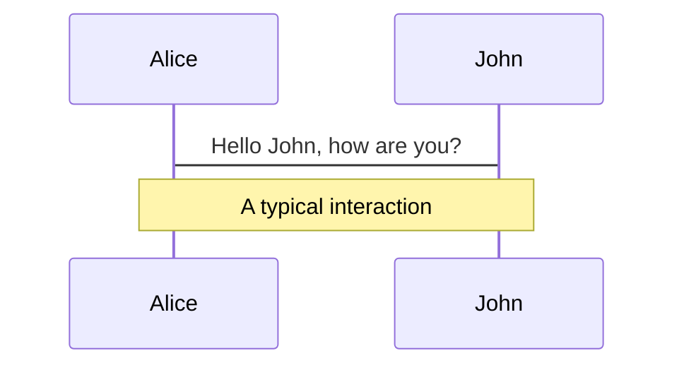
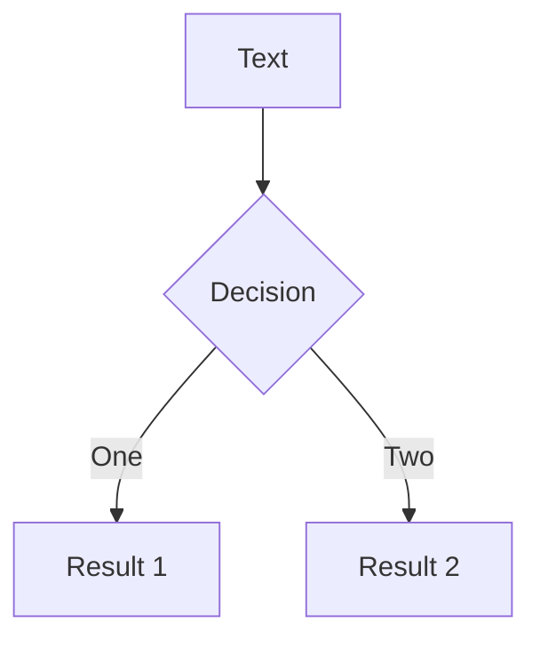
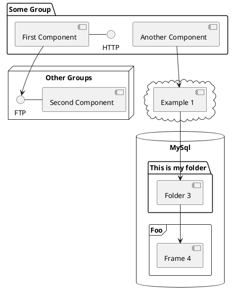

---
# try also 'default' to start simple
theme: apple-basic
# random image from a curated Unsplash collection by Anthony
# like them? see https://unsplash.com/collections/94734566/slidev
background: https://source.unsplash.com/collection/94734566/1920x1080
# apply any windi css classes to the current slide
class: 'text-center'
# https://sli.dev/custom/highlighters.html
highlighter: shiki
# show line numbers in code blocks
lineNumbers: false
# some information about the slides, markdown enabled
info: |
  ## Slidev Starter Template
  Presentation slides for developers.

  Learn more at [Sli.dev](https://sli.dev)
# persist drawings in exports and build
drawings:
  persist: false
# use UnoCSS
css: unocss
---

# Complexity in Boardgames

<br />
<br />

Goal
Analyze a boardgame to predict its complexity, then compare it with the corresponding BoardgameGeek weight

---

# How Can We Define Complexity?

<div class="grid grid-rows-1 grid-cols-3 centered-grid">
  <p>
    <b>Complexity</b> <br />
    <em>Complexity arises when a player follows one base rule, and in doing so changes the way that another base rule affects the game state</em>
  </p>
  <ep-circle-plus-filled class="text-4xl" />
  <p>
    <b>Depth</b> <br />
    <em>the depth of a game is more of a heuristic based on how many deep decisions are in the design</em>
  </p>
</div>


*Source: https://boardgamegeek.com/blogpost/108921/defining-complexity-and-depth-game-design*

<style>
  .centered-grid {
    justify-content: center; 
    align-content: center;
    grid-auto-flow: column; 
    align-items: center;
    justify-items: center;
  }
</style>

---

# Data Retrieval

<div style="display: flex; justify-content: center; align-items: center;">
  
  <div style="float: left">

  | Field | Description | How |
  | ----- | ----------- | ---- |
  | Id | The BGG Id of the boardgame | XMLAPI2 |
  | Name | The boardgame name | XMLAPI2 |
  | Averageweight | The average of the complexity scores given by the user | XMLAPI2 |
  | Playingtime | The playing time | XMLAPI2 |
  | Family | List of the boardgame's categories, like family game, strategy, etc | XMLAPI2 |
  | Rulebook | The boardgame's rulebook | Internal APIs |

  </div>
</div>

*XMLAPI2: https://boardgamegeek.com/wiki/page/BGG_XML_API2*

---

# Rulebook Download

How to automate the rulebooks' download? **No public APIs** and often **many documents to select from**
- Internal APIs for authenticated users

  ```python {all|2|6|all}
  async def get_bgg_filelist(client, thing_id: int) -> List[BoardGameFileInfo]:
      url = f"https://api.geekdo.com/api/files?ajax=1&nosession=1&objectid={thing_id}&objecttype=thing&pageid=1&showcount=25&sort=hot&languageid=2184"
      async with client.get(url) as response:
          content = await response.json()
          files = content['files']
          file_list = filter(lambda x: x is not None and x.extension == 'pdf', [BoardGameFileInfo.from_file_info(file) for file in files])
          return file_list
  ```
- Search engine based on Tf-Idf to choose the best document

  ```python {all|2|4|all}
  filelist = await get_bgg_filelist(client, thing_id)
  doc_vectors = vectorizer.fit_transform(f'{x.name} {x.plain_description}' for x in filelist)

  query_vector = vectorizer.transform(["revised official rule rulebook update new"])
  docs_ranked = cosine_similarity(query_vector, doc_vectors)

  # ... Take best doc only
  ```

---

# The BoardgameGeek Weight

<br />
<div class="barContainer">
  <span class="bar1 bar"></span>
  <span class="bar2 bar"></span>
  <span class="bar3 bar"></span>
  <span class="bar4 bar"></span>
  <span class="bar5 bar"></span>
</div>
<br />

<span style="margin-left: 5%">0</span>
<span style="float: right; margin-right: 5%">5</span>

- Amount of rules ✅
- Gameplay length ✅
- Amount of luck ✅
- Technical skill required (math, planning, reading, etc.) 🟡
- Amount of choices available ✅
- Amount of bookkeeping ❌
- Level of difficulty ❓

*Source: https://boardgamegeek.com/wiki/page/Weight*


<style>
  .barContainer { width: 90%; margin-left: 5%; float: left; }
  .barContainer span { 
    display: inline-block; 
    float: left;
    min-height: 1em;
  }
  .bar { width: 20% }
  .bar1 { background: #66ff66 }
  .bar2 { background: #b2ff66 }
  .bar3 { background: #ffff66 }
  .bar4 { background: #ffb266 }
  .bar5 { background: #ff6666 }
</style>

---

# Collecting BGG Data

- From 

dsd

Use code snippets and get the highlighting directly![^1]

```ts {all|2|1-6|9|all}
interface User {
  id: number
  firstName: string
  lastName: string
  role: string
}

function updateUser(id: number, update: User) {
  const user = getUser(id)
  const newUser = { ...user, ...update }
  saveUser(id, newUser)
}
```

<arrow v-click="3" x1="400" y1="420" x2="230" y2="330" color="#564" width="3" arrowSize="1" />

[^1]: [Learn More](https://sli.dev/guide/syntax.html#line-highlighting)

<style>
.footnotes-sep {
  @apply mt-20 opacity-10;
}
.footnotes {
  @apply text-sm opacity-75;
}
.footnote-backref {
  display: none;
}
</style>

---

# Components

<div grid="~ cols-2 gap-4">
<div>

You can use Vue components directly inside your slides.

We have provided a few built-in components like `<Tweet/>` and `<Youtube/>` that you can use directly. And adding your custom components is also super easy.

```html
<Counter :count="10" />
```

<!-- ./components/Counter.vue -->
<Counter :count="10" m="t-4" />

Check out [the guides](https://sli.dev/builtin/components.html) for more.

</div>
<div>

```html
<Tweet id="1390115482657726468" />
```

<Tweet id="1390115482657726468" scale="0.65" />

</div>
</div>

<!--
Presenter note with **bold**, *italic*, and ~~striked~~ text.

Also, HTML elements are valid:
<div class="flex w-full">
  <span style="flex-grow: 1;">Left content</span>
  <span>Right content</span>
</div>
-->


---
class: px-20
---

# Themes

Slidev comes with powerful theming support. Themes can provide styles, layouts, components, or even configurations for tools. Switching between themes by just **one edit** in your frontmatter:

<div grid="~ cols-2 gap-2" m="-t-2">

```yaml
---
theme: default
---
```

```yaml
---
theme: seriph
---
```


</div>

Read more about [How to use a theme](https://sli.dev/themes/use.html) and
check out the [Awesome Themes Gallery](https://sli.dev/themes/gallery.html).

---
preload: false
---

# Animations

Animations are powered by [@vueuse/motion](https://motion.vueuse.org/).

```html
<div
  v-motion
  :initial="{ x: -80 }"
  :enter="{ x: 0 }">
  Slidev
</div>
```

<div class="w-60 relative mt-6">
  <div class="relative w-40 h-40">
    
    
    
  </div>

  <div
    class="text-5xl absolute top-14 left-40 text-[#2B90B6] -z-1"
    v-motion
    :initial="{ x: -80, opacity: 0}"
    :enter="{ x: 0, opacity: 1, transition: { delay: 2000, duration: 1000 } }">
    Slidev
  </div>
</div>

<!-- vue script setup scripts can be directly used in markdown, and will only affects current page -->
<script setup lang="ts">
const final = {
  x: 0,
  y: 0,
  rotate: 0,
  scale: 1,
  transition: {
    type: 'spring',
    damping: 10,
    stiffness: 20,
    mass: 2
  }
}
</script>

<div
  v-motion
  :initial="{ x:35, y: 40, opacity: 0}"
  :enter="{ y: 0, opacity: 1, transition: { delay: 3500 } }">

[Learn More](https://sli.dev/guide/animations.html#motion)

</div>

---

# LaTeX

LaTeX is supported out-of-box powered by [KaTeX](https://katex.org/).

<br>

Inline $\sqrt{3x-1}+(1+x)^2$

Block
$$
\begin{array}{c}

\nabla \times \vec{\mathbf{B}} -\, \frac1c\, \frac{\partial\vec{\mathbf{E}}}{\partial t} &
= \frac{4\pi}{c}\vec{\mathbf{j}}    \nabla \cdot \vec{\mathbf{E}} & = 4 \pi \rho \\

\nabla \times \vec{\mathbf{E}}\, +\, \frac1c\, \frac{\partial\vec{\mathbf{B}}}{\partial t} & = \vec{\mathbf{0}} \\

\nabla \cdot \vec{\mathbf{B}} & = 0

\end{array}
$$

<br>

[Learn more](https://sli.dev/guide/syntax#latex)

---

# Diagrams

You can create diagrams / graphs from textual descriptions, directly in your Markdown.

<div class="grid grid-cols-3 gap-10 pt-4 -mb-6">







</div>

[Learn More](https://sli.dev/guide/syntax.html#diagrams)

---
src: ./pages/multiple-entries.md
hide: false
---

---
layout: center
class: text-center
---

# Learn More

[Documentations](https://sli.dev) · [GitHub](https://github.com/slidevjs/slidev) · [Showcases](https://sli.dev/showcases.html)
